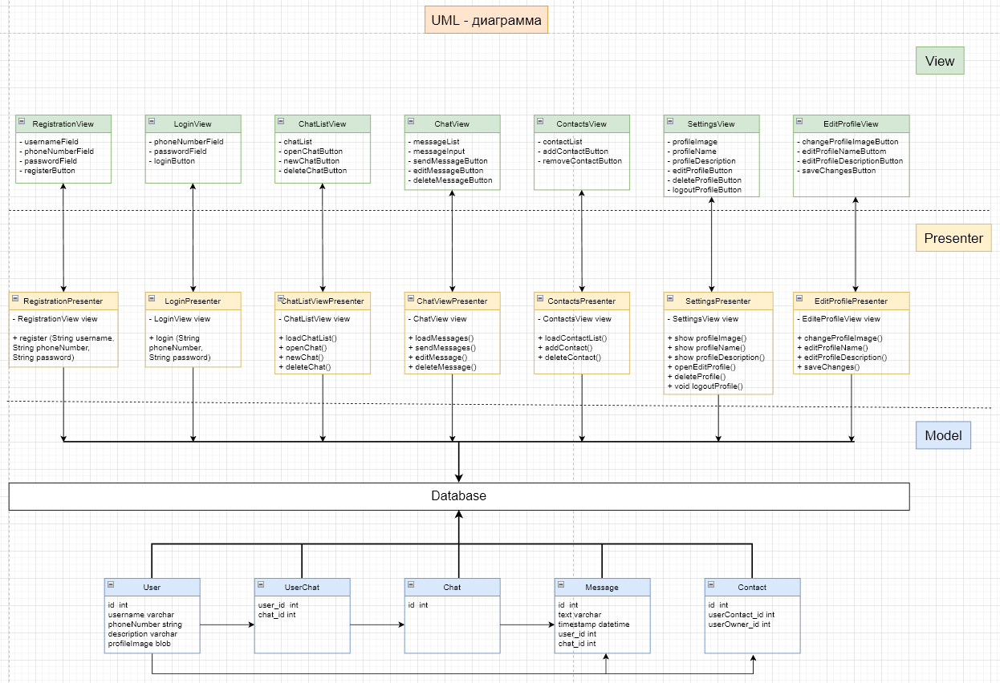

### Домашняя работа №12. Структура приложения с пользовательским интерфейсом и базой данных. Принципы тестирования приложений ###

Разработать приложение мессенджера (на выбор desktop/web/mobile). Требуется написать use case диаграмму, выбрать архитектуру для приложения (кратко обосновать выбор), UML и ER диаграммы для выбранной архитектуры. Используя метод персон (не менее 3), описать каких функций не хватает. Пересмотреть UML и ER диаграммы с учетом недостатков. Создать интерфейс в figma для приложения.

#### 1. Use Case диаграмма для приложения мессенджера ####

Use Case диаграмма для приложения мессенджера будет включать следующие пункты:

1. Регистрация пользователя.
2. Авторизация пользователя.
3. Список чатов.
4. Открыть чат.
5. Создать новый чат.
6. Удалить чат.
7. Отправить сообщение.
8. Редактировать сообщение.
9. Удалить сообщение.
10. Контакты:
    - добавить контакт;
    - удалить контакт.
11. Настройки:
    - редактировать профиль:
        - редактировать аватар;
        - редактировать имя пользователя;
        - редактировать описание.
    - удалить профиль;
    - выйти из профиля.

#### 2. Выбор архитектуры для приложения ####
Для приложения мессенджера выберем архитектуру MVP (Model-View-Presenter). Эта архитектура разделяет приложение на три основных слоя: Model, View и Presenter, что упрощает разработку и поддержку кода.\
Model отвечает за данные и бизнес-логику.\
View отвечает за отображение данных на экране.\
Presenter отвечает за связь между Model и View, а именно Presenter получает данные из Model и передает их в View для отображения. Кроме того, Presenter обрабатывает пользовательский ввод и вызывает соответствующие методы Model для выполнения необходимых действий.\
Такая архитектура позволяет улучшить тестирование кода, так как каждый компонент можно тестировать независимо от других. Также это позволяет улучшить переносимость кода между различными платформами и устройствами.\
В целом, архитектура MVP - это популярный (если верить великому Google), удобный и эффективный подход для разработки приложений, особенно в случае мессенджеров, где необходимо обрабатывать большое количество данных и пользовательского ввода.

#### 3. UML-диаграмма для приложения мессенджера ####

Первоначальная диаграмма\

Уточненная диаграмма\

#### 4. ER-диаграмма для приложения мессенджера ####

#### 5. Интерфейс в Figma для приложения ####

    Планируемый интерфейс мессенджера EasyTalk

1. Экран приветствия

2. Экран регистрации

3. Экран входа

4. Список чатов 

#### 6. Тестирование ####

Сценарий UAT-тестирования (приёмочное тестирование пользователя) мессенджера:

1. Пользователь запускает мессенджер.
2. Пользователь проходит процедуру регистрации нового пользователя. 
3. Пользователь выполняет вход в мессенджер.
4. Пользователь создает чат.
5. Пользователь отправляет сообщение в чат.
6. Пользователь выходит из мессенджера.

Результат:
1. Мессенджер запускается. 
2. Процедура регистрации нового пользователя выполняется.
3. Процедура входа в мессенджер выполнена.
4. Пользователь не может создать чат.
5. Пользователь может написать текст сообщения, но сообщение не отправляется.
6. Пользователь вышел из мессенджера.

Вывод:
1. Не работает кнопка создания нового чата.
2. Не работает кнопка отправки сообщения.